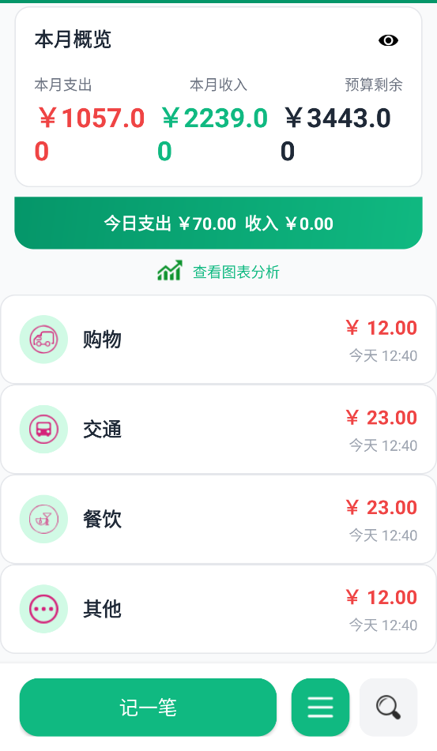
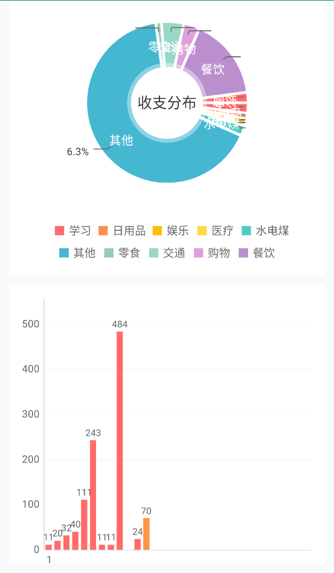
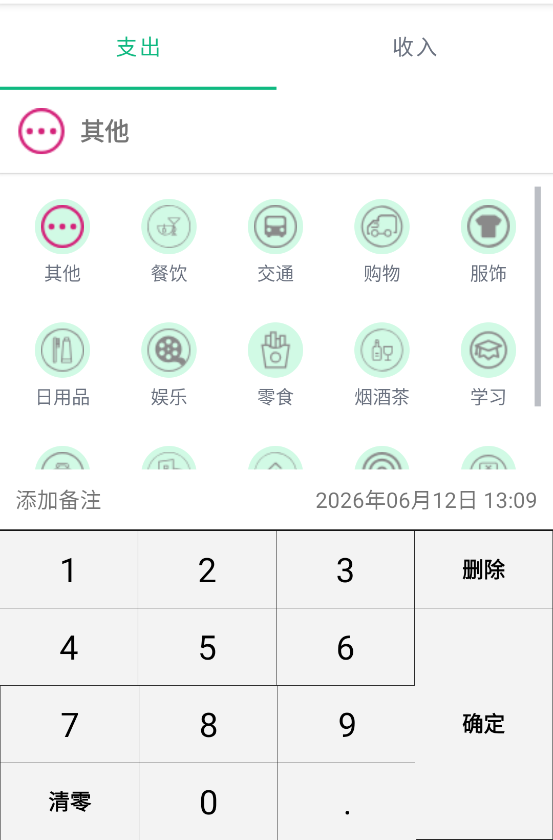

# 统计分析记账 · Statistical Analysis

<div align="center">

[](https://developer.android.com)
[](https://www.java.com)
[](https://developer.android.com/studio/releases/platforms#9)
[](https://developer.android.com/about/versions/14)
[](LICENSE)

**一款简洁、专业、实用的 Android 个人记账与财务分析应用**

*快速记录 · 直观图表 · 智能预算 · 数据安全*

</div>

***

## 📖 目录

- [✨ 核心功能](#-核心功能)
- [📸 应用截图](#-应用截图)
- [🛠 技术架构](#-技术架构)
- [📁 项目结构](#-项目结构)
- [🚀 快速开始](#-快速开始)
- [⚙ 开发环境](#-开发环境)
- [🤝 贡献指南](#-贡献指南)
- [📄 开源协议](#-开源协议)

***

## ✨ 核心功能

| 功能模块        | 描述                                             |
| ----------- | ---------------------------------------------- |
| 💰 **记账管理** | 一键记录每笔收支，支持 20+ 收支分类、自定义备注与时间选择，记录可随时编辑或删除     |
| 📊 **图表统计** | MPAndroidChart 驱动的饼图展示消费/收入分布，柱状图按日/月/年多维度对比分析 |
| 📈 **预算控制** | 灵活设置月度预算，首页实时显示剩余可用金额，避免超支，培养理性消费习惯            |
| 🔍 **智能搜索** | 支持关键词模糊搜索历史账单，搜索记录自动保存，快速定位所需记录                |
| 🔒 **隐私保护** | 一键切换金额明文/密文显示，保护敏感财务信息不被他人窥探                   |
| 💾 **数据备份** | 一键将数据库导出至本地存储，支持数据恢复，换机或重装无需担心数据丢失             |

***

## 📸 应用截图

<div align="center">

|                    <div align="center">**主页 · Home**</div>                    |                    <div align="center">**统计 · Analytics**</div>                   |                     <div align="center">**记账 · Record**</div>                     |
| :---------------------------------------------------------------------------: | :-------------------------------------------------------------------------------: | :-------------------------------------------------------------------------------: |
|                     <div align="center">今日收支概览预算实时显示</div>                    |                     <div align="center">饼图 + 柱状图多维度数据分析</div>                     |                      <div align="center">分类选择金额 & 备注输入</div>                      |
| <div align="center"></div> | <div align="center"></div> | <div align="center"></div> |

</div>

***

## 🛠 技术架构

本项目采用经典的 Android 原生开发架构，兼顾性能与可维护性：

### 技术栈

| 类别        | 技术选型                                               |
| :-------- | :------------------------------------------------- |
| **编程语言**  | Java 8                                             |
| **最低兼容**  | Android 8.0 (API 28)                               |
| **目标版本**  | Android 14 (API 34)                                |
| **UI 框架** | ConstraintLayout + Material Design                 |
| **图表库**   | MPAndroidChart v3.0.3                              |
| **数据存储**  | SQLite（`typetb` · `accounttb` · `searchhistorytb`） |
| **架构模式**  | Activity + Fragment + Adapter 模式                   |

### 核心数据表设计

| 表名                  | 用途    | 关键字段                  |
| ------------------- | ----- | --------------------- |
| **typetb**          | 收支类型表 | 类型名称、图标资源、类型标识（收入/支出） |
| **accounttb**       | 账单记录表 | 金额、类型、备注、日期时间、是否选中    |
| **searchhistorytb** | 搜索历史表 | 搜索关键词、时间戳             |

***

## 📁 项目结构

```
app/src/main/java/com/example/accounts/
├── MainActivity.java           # 🏠 主页 - 今日收支列表 & 预算概览
├── RecordActivity.java         # ✏️  记账 - 新增 / 编辑账单记录
├── ChartActivity.java          # 📊 图表 - 饼图 & 柱状图多维度统计
├── HistoryActivity.java        # 📜 历史账单 - 按时间浏览全部记录
├── SearchActivity.java         # 🔍 搜索 - 关键词查找历史账单
├── SettingsActivity.java       # ⚙  设置 - 预算、数据备份等配置
├── AboutActivity.java          # ℹ️  关于 - 应用版本与信息展示
├── userActivity.java           # 🔑 启动页 / 登录
│
├── db/                          # 💾 数据库层
│   ├── DBOpenHelper.java       # SQLiteOpenHelper - 建库建表 & 版本升级
│   ├── DBManager.java          # 数据库管理 - 统一 CRUD 操作封装
│   └── AccountBean.java        # 数据实体 - Account 表对应 Bean 类
│
├── adapter/                     # 🎯 适配器层
│   └── AccountAdapter.java     # ListView / ViewPager 适配器
│
├── frag_record/                 # 📋 记账 Fragment
│   ├── BaseRecordFragment.java # 基础记账 Fragment
│   ├── IncomeFragment.java     # 收入记账
│   ├── OutcomeFragment.java    # 支出记账
│   └── TypeBaseAdapter.java    # 类型选择适配器
│
└── utils/                       # 🔧 工具类
    ├── BudgetDialog.java       # 预算设置对话框
    ├── CalendarDialog.java     # 日期选择弹窗
    ├── DataBackupUtils.java    # 数据备份 / 恢复工具
    ├── MoneyUtils.java         # 金额格式化计算
    └── KeyBoardUtils.java      # 键盘交互工具

app/src/main/res/                # 🎨 资源文件 - 布局 / 图标 / 字符串
```

***

## 🚀 快速开始

### 环境要求

- **Android Studio**：Hedgehog (2023.1) 或更新版本
- **Gradle**：已内置，首次同步会自动下载
- **JDK**：Java 8 或更高版本

### 安装步骤

```bash
# 1. 克隆项目到本地
git clone https://github.com/Jiong-161/Statistical-Analysis.git

# 2. 使用 Android Studio 打开项目
#    File → Open → 选择项目根目录

# 3. 同步 Gradle
#    等待 Android Studio 自动同步并下载依赖

# 4. 运行应用 ▶
#    连接 Android 设备或启动模拟器，点击运行按钮
```

### 手动构建

```bash
# 进入项目目录
cd Statistical-Analysis

# 构建 Debug 版本
./gradlew assembleDebug

# 构建 Release 版本
./gradlew assembleRelease
```

***

## ⚙ 开发环境

| 组件                    | 版本要求                  |
| --------------------- | --------------------- |
| Android Studio        | Hedgehog (2023.1) 及以上 |
| Android Gradle Plugin | 与项目一致                 |
| JDK                   | Java 8+               |
| Android SDK           | API 28 - API 34       |

***

## 🤝 贡献指南

欢迎为「统计分析记账」项目贡献代码！

1. **Fork** 本仓库
2. 创建特性分支：`git checkout -b feature/AmazingFeature`
3. 提交更改：`git commit -m 'Add some AmazingFeature'`
4. 推送分支：`git push origin feature/AmazingFeature`
5. 发起 **Pull Request**

> 提交前请确保代码风格与现有代码保持一致，并充分测试！

***

## ❓ 常见问题

**Q: 如何修改预算金额？**\
A: 方法有两种——① 主页点击预算区域直接设置；② 进入「设置」页面找到预算配置项。

**Q: 数据会丢失吗？**\
A: 所有数据存储在本地 SQLite 数据库中，建议定期使用「数据备份」功能导出，换机时可一键恢复。

**Q: 最低支持哪个 Android 版本？**\
A: 应用最低兼容 Android 8.0（API Level 28），覆盖主流设备。

***

## 📄 开源协议

本项目基于 **MIT License** 开源协议发布，详见 [LICENSE](LICENSE) 文件。

***

<div align="center">

如果本项目对您有帮助，欢迎 **⭐ Star** 支持，也欢迎 **Fork** 参与贡献！

Made with ❤️ by [Jiong-161](https://github.com/Jiong-161)

</div>
